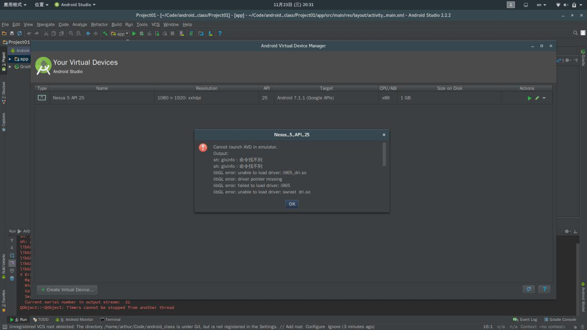

# AVD notwork



```
Confirmed. I create a symlink and then I can start the emulator without prepending LD_PRELOAD as stated before.

$ cd $ANDROID_HOME/android-sdk-linux_x86/tools/lib64/libstdc++
$ mv libstdc++.so.6 libstdc++.so.6.bak
$ ln -s /usr/lib64/libstdc++.so.6 $ANDROID_HOME/android-sdk-linux_x86/tools/lib64/libstdc++

Thank you for the hint!
```

### ref

* <https://bbs.archlinuxcn.org/viewtopic.php?id=4352>
